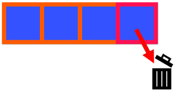
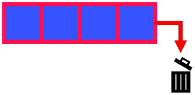

### Tema 3.  
# Vectores y matrices

> **Clases de programación en C++** · agosto de 2018  
> Miguel Ángel Fernández Gutiérrez ([@mianfg](https://mianfg.bloomgogo.com))

## 1. Motivación al uso de vectores

Queremos resolver el siguiente problema:

> Dado un conjunto de valores, queremos:
> * Calcular su media.
> * Decir cuántos alumnos superan la media.
> * calcular su moda.

Para contextualizar el problema, digamos que esos valores son las notas de una clase.

- - -

Vamos a comenzar resolviendo el problema dejando la moda: más adelante, terminaremos de resolver nuestro problema.

~~~c++
int nota_1, nota_2, nota_3;

cout << "Inserte las notas: ";
cin >> nota_1 >> nota_2 >> nota_3;

int media = (nota_1 + nota_2 + nota_3)/3, superan_media = 0;

if (nota_1 > media)
    superan_media++;
if (nota_2 > media)
    superan_media++;
if (nota_3 > media)
    superan_media++;

cout << "La media de las notas es: " << media << endl
     << "El número de notas que superan la media es: "
     << superan_media << endl;
~~~

Apreciemos cómo es necesario constatar dónde vamos a almacenar cada una de las notas, por lo que es necesario declarar una variable para cada nota. Por ello, hemos resuelto el problema para _n = 3_.

¿Qué pasa si queremos resolver el problema general, esto es, para cualquier _n_? **¡Para eso tenemos los vectores!**

- - -

## 2. Concepto de vector

Un objeto de tipo vector es una estructura de datos que cumple:

- Es **compuesto**: puede contener múltiples objetos.
- Es **homogéneo**: todos los objetos deben ser del mismo tipo.

Al declarar un vector de un cierto tamaño, estamos declarando muchas variables de un mismo tipo encadenadas en memoria.

Por ejemplo, si tuviésemos un vector de _n_ valores de tipo `double`, podríamos almacenar _n_ notas diferentes, de forma encadenada.

Esto nos permite agilizar nuestro código de forma significativa, debido a que los vectores nos permiten realizar operaciones.

> MUY IMPORTANTE  
> El tipo vector no está definido en el lenguaje, sino en una clase de C++ contenida en std. Para hacer uso de él, es **necesario incluir el fichero de cabecera `vector`**.
> ~~~c++
> #include <vector>
> ~~~

- - -

Para poder manejar cada uno de los elementos contenidos, el vector los organiza mediante un **índice**.

Tomando el mismo ejemplo anterior, los índices quedarían:

En general, podemos representar un vector con el siguiente esquema:

- - -

## 3. Operaciones básicas con vectores

### 3.1  Declaración

Para trabajar con objetos, debemos **crearlos**. Es para ello necesario especificar el tipo contenido. Opcionalmente, se puede especificar el tamaño y el valor con el que inicializarlo.

#### Vector de tipo `type` y tamaño cero

~~~ c++
vector<type> v;
~~~

De este modo, hemos creado un vector de `type` vacío.

#### Vector de tipo `type` y tamaño `n`

~~~ c++
vector<type> v(n);
~~~

De este modo, hemos creado un vector de `type` de `n` elementos. Dependiendo del tipo, se inicializarán a un valor u otro (_¡experimenta para comprobarlo!_).

#### Vector de tipo `type` y tamaño `n` inicializado a `i`

~~~ c++
vector<type> v(n, i);
~~~

De este modo, hemos creado un vector de `type` de `n` elementos, en el que todos los elementos tienen el valor `i` (inicialización), que debe ser de tipo `type`.

### 3.2  Asignación

Podemos asignar un vector a otro, o inicializarlo con un vector _raw_, es decir, un vector escrito de la forma `{...}`, siempre que todos los elementos sean del mismo tipo que el vector declarado.

~~~ c++
vector<double> notas = {9.8, 7.2, 5.6, 9.2, 8.8};
vector<double> notas_2 = notas;
~~~

### 3.3  Acceso: operador `[]`

Para acceder al valor con índice `i` del vector `v`, basta hacer **`v[i]`**.

### 3.4  Modificación (asignación por elementos)

Podemos usar los operadores anteriores para hacer uso de la asignación para cada uno de los valores individuales.

~~~ c++
notas[0] = 6;  // modifica notas a 6.0
~~~

- - -

## 4. Operaciones específicas de la clase `vector`

### 4.1  Acceso y modificación: operador `at()`

Podemos usar en lugar del operador `[]` el operador `at()`, incorporado en la clase vector.

> La diferencia entre `at()` y `[]` se encuentra explicada en la relación de ejercicios.

~~~ c++
cout << notas.at(0);  // lo mismo (casi) que cout << notas[0]
notas.at(0) = 10;     // lo mismo (casi) que notas[0] = 10
~~~

### 4.2  Comprobación de tamaño: `size()`

Esta función de la clase `vector` devuelve un dato de tipo `int`, correspondiente al número de elementos del `vector`.

~~~ c++
cout << notas.size();  // muestra 5
~~~

- - -

##### ¡Ya estamos en condiciones de resolver nuestro problema!

~~~ c++
#include<iostream>
#include<vector>
using namespace std;

int main() {
    int num_notas;
    cout << "Inserte cuántas notas insertará: ";
    cin >> num_notas;

    vector<double> notas(num_notas);
    for ( int i = 0; i < notas.size(); i++ )
        cin >> notas[i];
    
    double media = 0;
    for ( int i = 0; i < notas.size(); i++ )
        media += notas[i];
    media /= notas.size();
    double moda = 0;

    int superan_media = 0;
    for ( int i = 0; i < notas.size(); i++ )
        if ( notas[i] > media )
            superan_media++;

    for ( int i = 0; i < notas.size(); i++ )
        if ( notas[i] > moda )
        moda = notas[i];

    cout << "Media: " << media << endl
         << "Superan la media: " << superan_media << endl
         << "Moda: " << moda << endl;
}
~~~

- - -

### 4.3  Variación de tamaño: `push_back()`, `pop_back()` y `clear()`

| Imagen | Función | Descripción |
| --- | --- | --- |
|  | `v.push_back(x)` | Inserta al vector el elemento `x` al final de éste. Debe ser del mismo tipo que el vector. |
|  | `v.pop_back()` | Elimina el último elemento del vector. |
|  | `v.clear()` | Vacía el vector. |

- - -

##### ¡Ahora podemos mejorar la solución a nuestro problema!

~~~ c++
#include<iostream>
#include<vector>
using namespace std;

int main() {
    vector<double> notas;
    double entrada;

    cout << "Inserte todas las notas que quiera,
            finalice con una nota no válida: ";
    
    do {
        cin >> entrada;
        if ( entrada >= 0 && entrada <= 10 )
            notas.push_back(entrada);
    } while ( entrada >= 0 && entrada <= 10 );

    double media = 0;
    for ( int i = 0; i < notas.size(); i++ )
        media += notas[i];
    media /= notas.size();
    double moda = 0;

    int superan_media = 0;
    for ( int i = 0; i < notas.size(); i++ )
        if ( notas[i] > media )
            superan_media++;

    for ( int i = 0; i < notas.size(); i++ )
        if ( notas[i] > moda )
        moda = notas[i];

    cout << "Media: " << media << endl
         << "Superan la media: " << superan_media << endl
         << "Moda: " << moda << endl;
}
~~~

- - -

### 4.4  Otros operadores

La clase `vector` tiene definida multitud de operadores. Sin embargo, con los anteriores, podemos resolver todos los problemas que hagan falta con vectores.

En la relación de ejercicios se introducen otros operadores. La lista completa la puedes ver en la referencia de C++:

<http://www.cplusplus.com/reference/vector/vector/>
